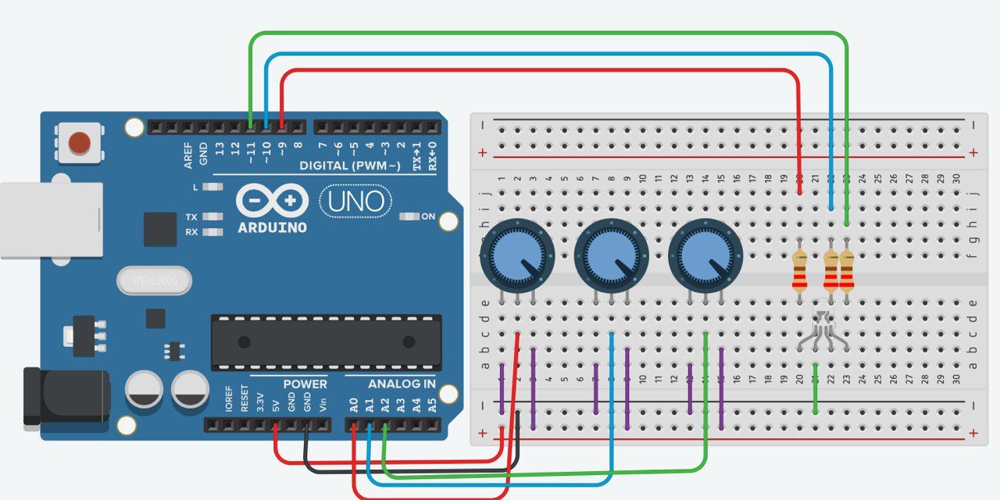

# Arduino- Led RBG acompañado de potenciometros

Controlaremos un led RGB  Con potenciometros

## Materiales
- Arduino Uno 
- Led RGB
- 3 resistencias de 220 oms
- 3 potenciometros 

## Esquema de conecion

